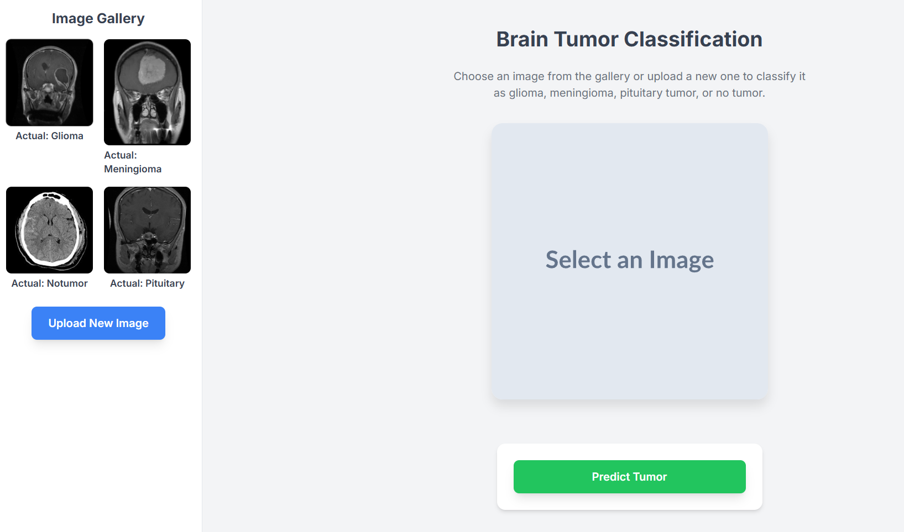

<p>
  <h2 style="font-size:25px;">Test My Model 👉
   <a href="https://brain-tumor-detection-jeet.onrender.com" target="_blank">
       Brain Tumor Detection App
   </a></h2>
</p>

---

# 🧠 Brain Tumor Detection

A deep learning-powered web application for automatic brain tumor classification from MRI images.  
Built with **Flask**, **TensorFlow/Keras**, and deployed on **Render**.

---

## 🚀 Features

- Upload MRI images and get instant tumor type predictions
- Supports four classes: **Glioma**, **Meningioma**, **Pituitary**, and **No Tumor**
- Clean, responsive UI with image gallery
- Model file is downloaded automatically at runtime (not stored in the repo)
- Easy deployment on Render or any cloud platform

---

## 🖼️ Demo



---

## 🗂️ Project Structure

```
Brain_Tumor_Detection/
│
├── app.py
├── model_info.yaml
├── requirements.txt
├── templates/
│   └── index.html
├── static/
│   ├── images/
│   └── uploads/
├── .gitignore
└── README.md
```

---

## ⚡ Quick Start

### 1. **Clone the repository**

```sh
git clone https://github.com/Jeet-047/brain-tumor-detection.git
cd brain-tumor-detection
```

### 2. **Install dependencies**

```sh
pip install -r requirements.txt
```

### 3. **Model File Setup**

- The model file (`brain_tumor.keras`) is **not included** in the repository due to GitHub's file size limits.
- On first run, the app will **automatically download** the model from the link specified in `model_info.yaml`.

### 4. **Run the app**

```sh
python app.py
```

- Open your browser and go to [http://localhost:5000](http://localhost:5000)

---

## 🧩 How It Works

- **Upload** an MRI image via the web interface.
- The app **preprocesses** the image and feeds it to the trained model.
- The model predicts the tumor type and displays the result.

---

## 🏷️ Model Download Details

- The model file is hosted externally (e.g., [GitHub Releases](https://github.com/Jeet-047/brain-tumor-detection/releases)).
- The download URL and local path are specified in `model_info.yaml`:

```yaml
MODEL_URL: "https://github.com/Jeet-047/brain-tumor-detection/releases/download/bt_model_v1/brain_tumor.keras"
MODEL_PATH: "brain_tumor.keras"
```

---

## 📝 .gitignore

This project ignores:
- Python virtual environments
- Model files
- Python cache files

```gitignore
env
brain_tumor.keras
__pycache__/
```

---

## 🌐 Deployment

### Deploy on [Render](https://render.com):

1. Connect your GitHub repo to Render.
2. Set the build and start commands:
   - **Build Command:** `pip install -r requirements.txt`
   - **Start Command:** `python app.py`
3. The model will be downloaded automatically on first deploy.

---

## 📚 Acknowledgements

- [Kaggle Brain Tumor Dataset](https://www.kaggle.com/datasets/masoudnickparvar/brain-tumor-mri-dataset)
- [TensorFlow](https://www.tensorflow.org/)
- [Flask](https://flask.palletsprojects.com/)

---

## 🤝 Contributing

Pull requests are welcome!  
For major changes, please open an issue first to discuss what you would like to change.

---

## 📄 License

This project is licensed under the MIT License.

---
